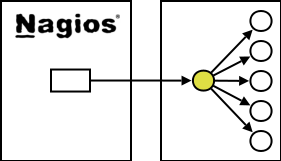

## What is check_multi?

check_multi is a multi purpose wrapper plugin which takes benefit of the 
Nagios 3.x capability to display multiple lines of plugin output. 

It calls multiple child plugins and displays their output in the 
long_plugin_output. A summary is given in the standard plugin output.

The child return code with the highest severity becomes the parent 
(check_multi) plugin return code.

The configuration is very simple: a NRPE-stylish config file contains 
a tag for each child plugin and then the check command line.

*check_multi* can cover complex Business Process Views - using a builtin state evaluation mechanism. The second benefit is cluster monitoring with no need for extra services. All you need is provided by *check_multi*.

### 
| Nagios as you know it   | Nagios with check_multi |
| -------------------------   | --------------------------- |
|  | |

## Concept discussion

The new Nagios 3.x multiline output feature allows to combine multiple
service checks in one run. 

### There are lots of advantages for this:

#### Performance boost
The Nagios server is no more dealing with multiple checks and can bear a lot of more servers to monitor. (The author has got a latency < 1s and a load around 1 with 400 servers and 25000 child checks on a single HP DL 380.)

#### Visualization  
In the extended plugin output you get a neat and comprehensive HTML output where non-OK facts are visible while standard OK checks are masked to keep an eye to the really important information.

#### Functional grouping
Nagios services are often a unordered list of functions where it's not clear to which application or server function they belong. check_multi helps to group them and provides clear and lean information.

#### Configuration delegation  
The complicated Nagios core configuration is still to be done by the experienced Nagios admin while the gory threshold tuning can be delegated to the system or Oracle or webserver teams. More: the configuration of the plugin can be changed without restarting Nagios. It will be read before each run.

#### Ease of configuration
There's no need any more for a sophisticated distributed monitoring if all hosts can be monitored on one server.

#### KISS
The good old Unix principle to keep it small and simple. Its not necessary to write big and complicated multi-purpose plugins. Just write one lean and tiny plugin for each task and combine them within check_multi.

#### Compliancy  
The plugin is fully compliant to the [Nagios plug-in development guidelines]() and behaves just like any other plugin.

### But there are also some disadvantages:

#### There Can Be Only One
Only the parent plugin is visible in Nagios context: there is only one notification, one escalation logic.

#### Nagios 2.x
You can see only a single status line. But: [here](projects/check_multi/configuration/options#r_--report_level) you find a special Nagios2 output option.
