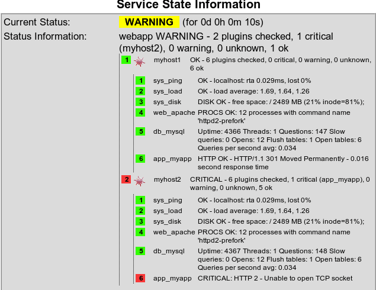

# Business Process Views

### Motivation and definition

The classical monitoring approach works with the reduction of all monitored items to small independent units. With these units the monitoring configuration is feeded: disks, processes, databases, log messages, etc. etc.

The basic problem of this processing is that the small units lose their context. It's not obvious any more that the disk belongs to the application, that the DB malfunction is the root cause for the application failure and that the dying daemon affects the application communication.

At this point the *Business Process Views* enter the stage: they are a basic means to present a consolidated view of different parameters and attributes belonging to a particular process.

### Example: A Web Application 

This example describes the monitoring of just a plain web application, such as everybody runs in his company. This application runs on a standard *nix server of course on Apache web server, uses a MySQL DB for data storage and - for simplification purposes - provides its contents in the companies intranet. So far - so good.

### What should be monitored?

If you miss something important: numerous monitoring items which may be significant for this web applicaton are left off here due to demonstration simplicity ;-).


#### Monitoring matrix:
| System  ||         
| ----------          | ---------					|
| Ping                | ```check_icmp -h myhost```                        | 
| Load                | ```check_load -w 3,4,5 -c 6,8,10```               | 
| Disk                | ```check_disk -w 5% -c 2% -p / -p /var -p /opt``` | 
| Webserver  ||      
| Apache              | ```check_procs -c 1: -C httpd```                  | 
| Database server  ||
| MySQL               | ```check_mysql```                                 | 
| Application ||     
| End2end             | ```check_http -H myhost -u `<URL>````               | 


### Creation of cmd file

#### File myapp.cmd:
```
#--- Web-Application myapp
command [ sys_ping   ] = check_icmp -H myhost
command [ sys_load   ] = check_load -w 3,4,5 -c 6,8,10
command [ sys_disk   ] = check_disk -w 5% -c 2% -p / -p /var -p /opt
command [ web_apache ] = check_procs -c 1: -C httpd
command [ db_mysqld  ] = check_mysql
command [ app_myapp  ] = check_http -H myhost -u http ://myhost/myapp
```


### Test on the command line

OK, everything seems to work fine ;-)

```
nagios@thinkpad ~/libexec> ./check_multi -f myapp.cmd -r 0
WARNING - 6 plugins checked, 0 critical, 1 warning, 0 unknown, 5 ok
[ 1] sys_ping OK - myhost: rta 110.090ms, lost 0%
[ 2] sys_load WARNING - load average: 3.50, 3.40, 3.39
[ 3] sys_disk DISK OK - free space: / 2409 MB (20% inode=81%);
[ 4] web_apache PROCS OK: 11 processes with command name 'httpd2-prefork'
[ 5] db_mysql Uptime: 1134116 Threads: 1 Questions: 8888 Slow queries: 0 Opens: 12 Flush tables: 1 Open tables: 6 Queries per second avg: 0.008
[ 6] app_myapp HTTP OK - HTTP/1.0 302 Found - 0.290 second response time
```

### The first business process view is ready to work

*  It only has to be [included](configuration/nagios.md) into Nagios configuration. 
*  Normally you want to monitor a remote host, so enter the prefered transport means (mostly check_nrpe or check_by_ssh).
*  If you want to add more items to the configuration: go for it, you only have to change the config file ''myapp.cmd''. No further restart of Nagios is needed if the service itself has been successfully included. 
*  If you want to change the thresholds: no problem. Just change ''myapp.cmd'' and the new values go into effect after the next interval.

### Enhancement: Clustering

If the function of a business critical application needs to be garantueed it will often be clustered. There are several strategies to achieve this - especially for web applications one of the favourite setups is a server farm where all incoming requests are spreaded onto the farm members. 
For our setup it means that we have to duplicate the monitoring for all farm members. But there is a difference in the result evaluation. The overall result should only be critical if all members of the farm are reachable any more.


### Step by step

 1.  Setup of a Web Application Monitoring for all members of the farm.
     We can reuse the ''myapp.cmd'' with one small change: instead of ''myhost'' we should mention ''localhost'', so it's the same filename on each host and we do not have to attend different files.\\ \\  
 2.  Creation of a master check which includes one check per host:


#### webapp.cmd (part 1):
```
command [ myhost1  ] = check_nrpe -H myhost1 -c check_multi -a -f myapp.cmd
command [ myhost2  ] = check_nrpe -H myhost2 -c check_multi -a -f myapp.cmd
```

#### Setup of the evaluation logic
Normally the overall state is CRITICAL if one check is critical. In our setup one node can be down and the web application is still up. But the administrator has to be aware that he has to fix the broken server and should be alarmed with a WARNING state.\\ 

#### webapp.cmd (part 2):
```
state   [ CRITICAL   ] = COUNT(CRITICAL) > 1
state   [ WARNING    ] = COUNT(WARNING) > 0 || COUNT(CRITICAL) > 0
```

### Business Process View in work

That's all ;-)


