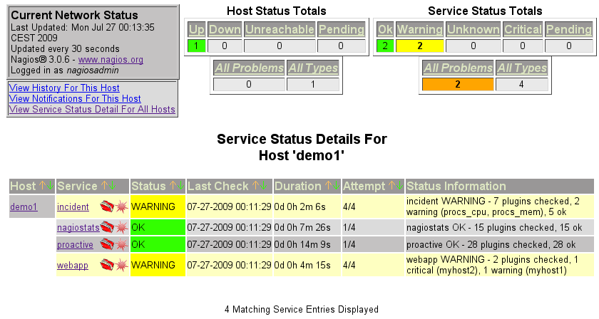
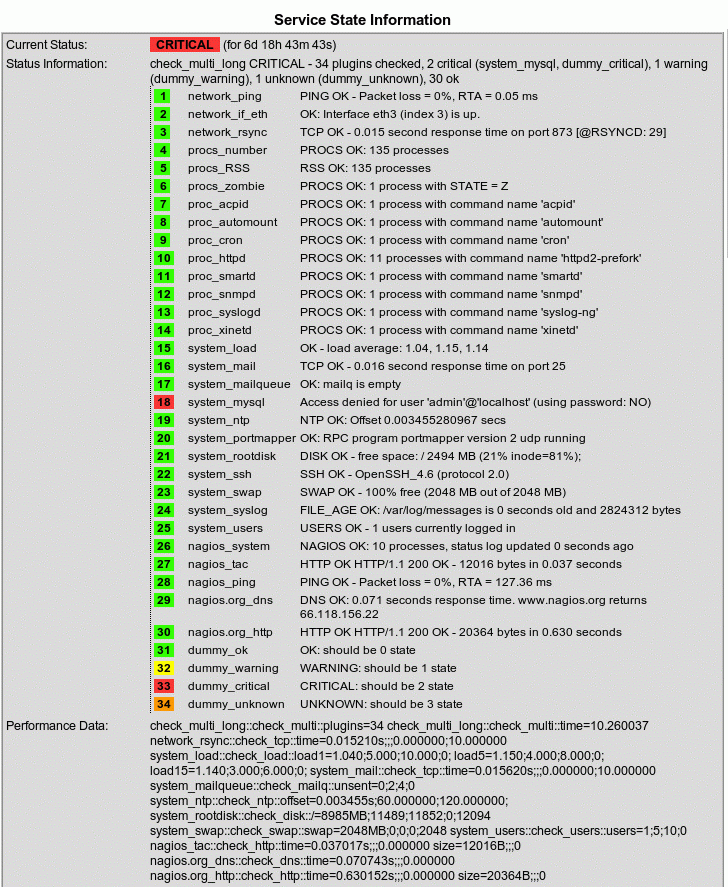
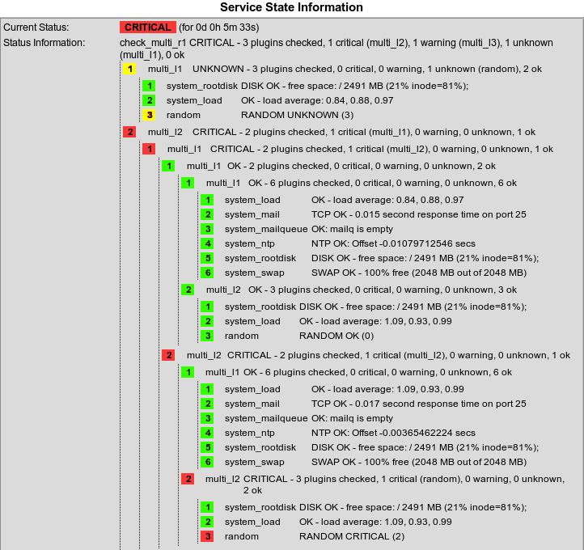
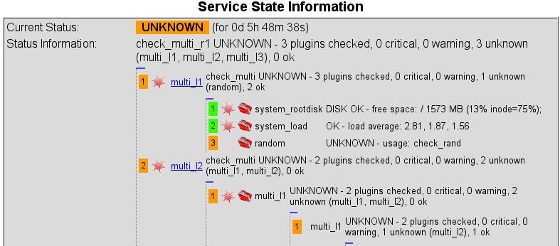
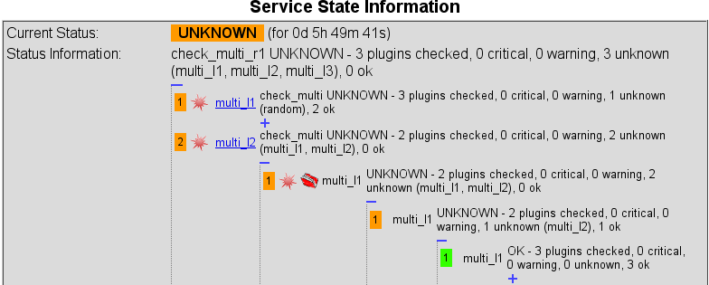
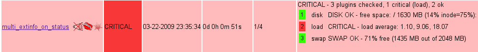
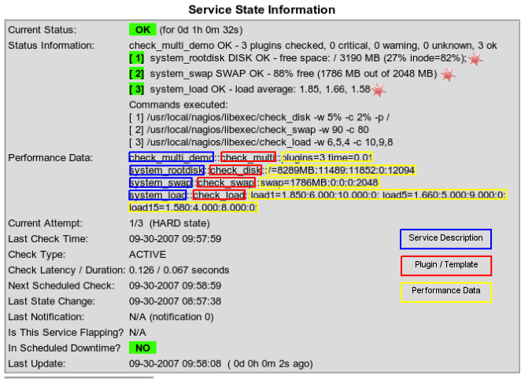

## Screenshots

### Services


  
### Service extended info

  
  
### Recursive service extended info

  
  
### Show and hide child checks

The blue cross presents a Javascript feature to hide or to show subtrees of a check_multi check.

*Note*: as a default all OK states are hidden, while all non-OK states are shown. This ensures that you see important information while all the normal details don't bother.

### Subtree multi_l1 shown


  
### Subtree multi_l1 hidden


  
### Child checks in the Nagios Status View

This behaviour can be activated by using the flag ```-s extinfo_on_status=1```.



### Performance data


### Command line

```
	nagios@thinkpad:~/libexec> ./check_multi -f ../etc/check_multi_small.cmd 
	WARNING - 6 plugins checked, 1 warning (system_rootdisk), 5 ok
	[ 1] system_load OK - load average: 2.32, 2.51, 2.59
	[ 2] system_mail TCP OK - 0.016 second response time on port 25
	[ 3] system_mailqueue OK: mailq is empty
	[ 4] system_ntp NTP OK: Offset -0.007921357057 secs
	[ 5] system_rootdisk DISK WARNING - free space: / 412 MB (3% inode=81%);
	[ 6] system_swap SWAP OK - 65% free (1317 MB out of 2048 MB) 
	|check_multi::check_multi::plugins=6 time=0.65 system_load::check_load::load1=2.320;6.000;10.000;0; load5=2.510;5.000;9.000;0; load15=2.590;4.000;8.000;0;  system_mail::check_tcp::time=0.015503s;;;0.000000;10.000000 system_mailqueue::check_mailq::unsent=0;2;4;0 system_ntp::check_ntp::offset=-0.007921s;60.000000;120.000000; system_rootdisk::check_disk::/=11067MB;11489;11852;0;12094 system_swap::check_swap::swap=1317MB;0;0;0;2048  
``` 
	

